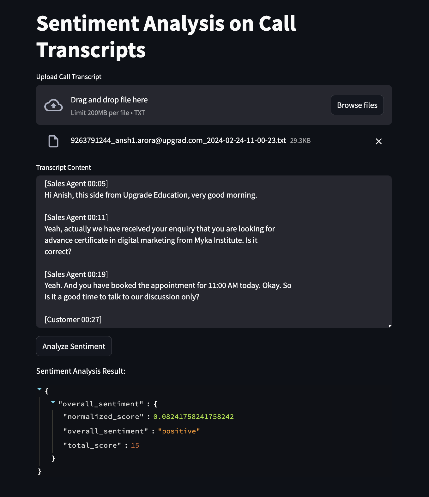

# Sentiment Analysis on Phone Call Transcripts

This project is a web-based application that performs sentiment analysis on uploaded call transcripts. Users can upload text files through a Streamlit-based UI, and the backend, powered by Flask, processes the files and returns sentiment analysis results.

The app uses a pre-trained Hugging Face Transformer model to classify sentiments into Positive, Negative, or Neutral, along with corresponding sentiment scores.



## Project Structure

```
sentiment-analysis/
├── backend
│   └── app.py
|   └── demo.py    # to ananlyse the file locally on terminal
├── frontend
│   └── streamlit_app.py
├── readme.md
├── requirements.txt
├── .gitignore
└── readme.md               
```

## Getting Started

### Prerequisites

- Python 3.11.11
- Required Python packages (listed in `requirements.txt`)

### Installation

1. Clone the repository:
    ```sh
    git clone https://github.com/Princccee/Sentiment_analysis.git
    ```
2. Create a virtual environment:
    ```sh
    python3 -m venv .venv
    source .venv/bin/activate
    ```    
3. Navigate to the project directory:
    ```sh
    cd sentiment-analysis
    ```
4. Install the required packages:
    ```sh
    pip install -r requirements.txt
    ```
5. Run the backend server:
    ```sh
    python backend/app.py
    ```
6. Run the streamlit app in browser:
    ```sh
    streamlit run frontend/streamlit_app.py
    ```    


<!-- ## Usage

1. **Data Preprocessing**:
    ```sh
    python src/data_preprocessing.py
    ```
    This script will preprocess the raw phone call transcripts and save the processed data.

2. **Model Training**:
    ```sh
    python src/model_training.py
    ```
    This script will train the sentiment analysis model using the processed data.

3. **Sentiment Analysis**:
    ```sh
    python src/sentiment_analysis.py
    ```
    This script will perform sentiment analysis on new phone call transcripts and output the sentiment (positive or negative). -->

<!-- ## Results

The results of the sentiment analysis, including evaluation metrics, will be saved in the `results/` directory. -->


